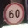

# Traffic Sign Classifier

     

This repo contains code for images of traffic sign classification from *German Traffic Sign Database* [GTSRB](http://benchmark.ini.rub.de/?section=gtsrb&subsection=news). Originally, it was the task of the second project from Udacity Self-Driving Car Engineer Nanodegree, but now there are some my independent experiments added.
The train dataset consists of 39209 images with 32x32 px resolution, test dataset - 12630. The datasets were provided by *Udacity*.

## Notebooks:

`Traffic_Sign_Classifier.ipynb` Udacity Self-Driving Car Engineer Nanodegree. Project: Build a Traffic Sign Recognition Classifier. Finally, **95.0%** accuracy on the test dataset achieved with one Convolutional neural network, based on GoogLeNet inception modules. The code uses TensorFlow only. Look through this [file](https://github.com/NikolasEnt/Traffic-Sign-Classifier/blob/master/Traffic_Sign_Classifier.ipynb) to make yourself familiar with data and the implementation. `train_log_f.csv` is a log file of the CNN training process.

`Traffic_Sign_Classifier-2Net.ipynb` Experiments with two Convolutional neural network, also based on inception modules. Basic idea: train two CNN: one - for traffic sign classification in general, and second - for numbers on speed limit sign classification. It should work better then only one CNN, which was used originally for the project as it was observed, that it usually wrong classify speed limits, but is correct about sign type. This implementation uses Keras with TensorFlow as backend. *Under development*
